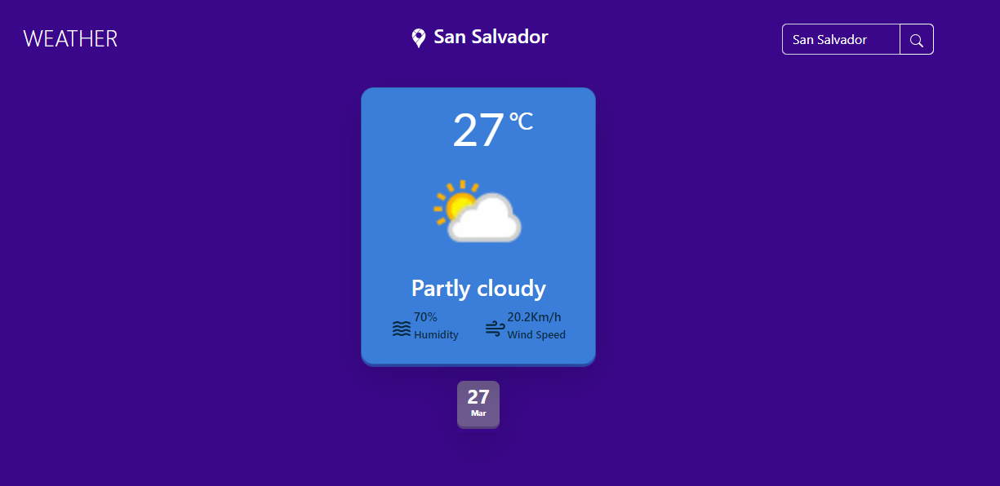

# Weather App

Este proyecto está hecho con React usando create-react-app, JavaScript, HTML, CSS y Bootstrap.

El proyecto pide al usuario el nombre de una ciudad para buscarla usando la API de https://www.weatherapi.com/ y mostrar la información del clima en tiempo real.

El diseño de la web está basado en el siguiente enlace: https://dribbble.com/shots/17998454-Weather-website


## Autores

- [@JonathanEKP](https://www.github.com/JonathanEKP)

## Tech Stack

**Client:** 
- Bootstrap
- React
- create-react-app
- JavaScript
- HTML
- CSS


## Referencias de colores

| Color             | Hex                                                                |
| ----------------- | ------------------------------------------------------------------ |
| Blue Background |  #3A078A |
| Sky Blue Card |  #3B7ED9 |
| Lilac Date Card |  #6C588D |


## Despliegue

Para poder correr el proyecto puede usar el siguiente enlace publicado en github pages:
- https://jonathanekp.github.io/weatherApp/

O puede descargar el proyecto y correrlo localmente en su maquina con los siguientes pasos:

### Clone el repositorio

```bash
  git clone https://github.com/JonathanEKP/weatherApp
```

### Vaya a la ubicación del proyecto

```bash
  cd weatherApp
```

### Instale las dependencias necesarias

```bash
  npm install
```

### Inicie el servidor

```bash
  npm start
```


## Screenshots

### Estado de los componentes al iniciar la web


### Estado de los componentes cuando se hizo una busqueda con exito


## Feedback

Si tienes alguna sugerencia, por favor hazmela saber a mi correo jonathanvaldez2001@gmail.com
